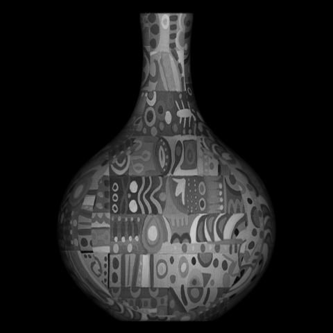
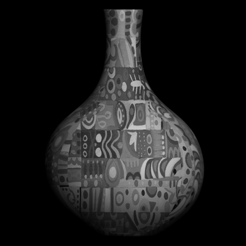
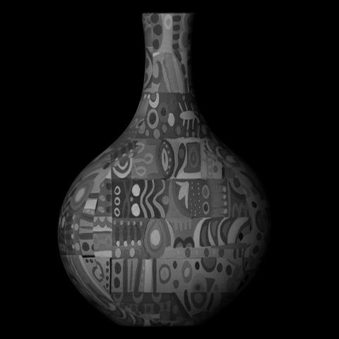
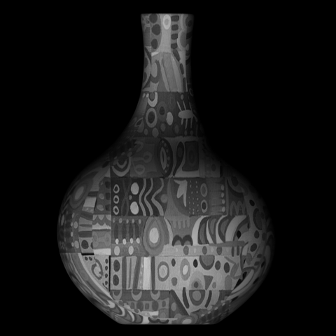
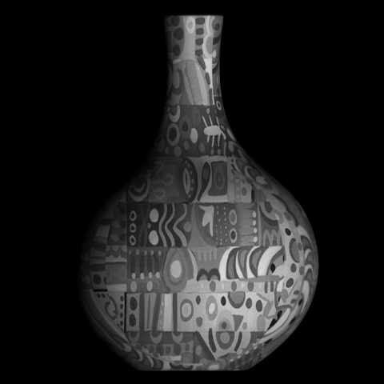
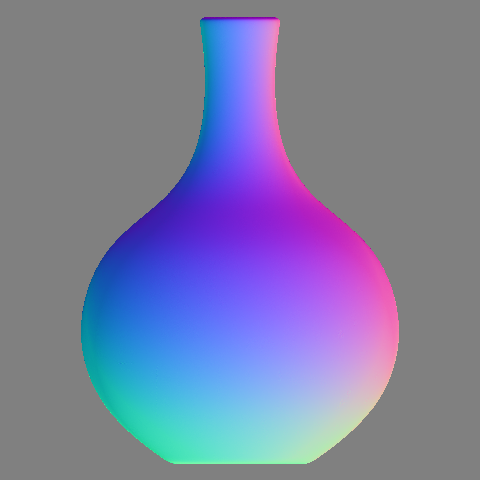
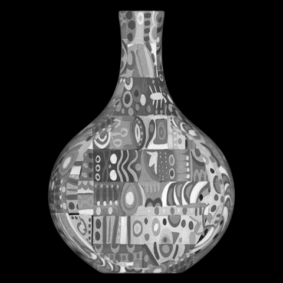
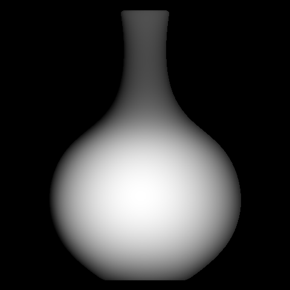
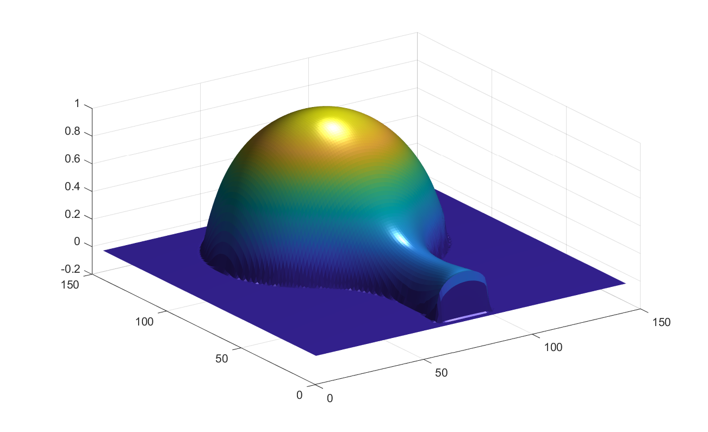

## UW-Madison CS 766  - Spring 2019 

This repository contains selected MATLAB programming assignments I have completed as part of the Spring 2019 Computer Vision class at UW-Madison.

In each homework folders I have included explanation of scripts and answers in the markdown file **README.md**

### Example from [Homework 5](https://github.com/ychuang6/computer-vision-766/tree/master/hw5_photometric_stereo)

Goal: Reconstruct shape, surface normal and reflectance of an object from the given images. 

Here are the sample images given to reconstruct a vase:

  
  
  
  
  

**Results**

Resulting images of:

 Surface normal | Reflectance 
:------------- | :------------- 
  |  

 Reconstructed surface | 3D Surface reconstruction 
:------------- | :------------- 
  |  

