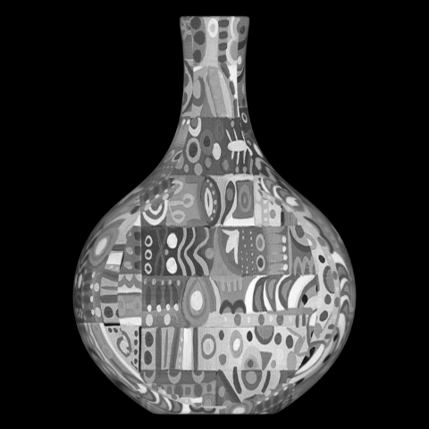
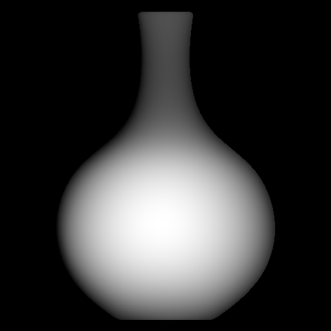

## CS766 Spring 2019: Homework 5

Author: YJC

Homework challenge: Develop a vision system that recovers the shape, surface normal, and reflectance of an object using photometric stereo. 
5 images of an object taken using 5 different light sources are given and the task is to compute surface normal and albedo for the object.

To run the homework, type:
```
runHw5('all')
```
To run selected tests:
```
runHw5('challenge1a')
runHw5('challenge1b')
```

### Challenge 1(a)

The function **imbw** is used to convert the image into binary. 
Then, using the function **regionprops**, the feature 'Centroid' is used to obtain the center coordinates of the circle.
The feature 'Area' is used to obtain the area of the circle, and square root of the area divided by pi will be the radius. 
Similarly, the half of 'EquivDiameter' can be used to obtain the radius of the circle. 

Centroid of circle for this image is [255.21, 244.03], radius of circle is 170.37, area of circle is 91191. 


### Challenge 1(b)

The brightest surface spot on the sphere is calculated by obtaining the mean coordinates of all of the largest pixel value in all respective images. 
Using this point coordinate, in addition to center coordinates and the value of radius of the sphere in 3D space, we can form the following equations/codes:
```
	Radius = sqrt((x - x_center)^2 + (y - y_center)^2 + (z^2) )
	z = sqrt( Radius^2 - (x - x_center)^2 + (y - y_center)^2 )
```

In 3D space, with z known at this point, the surface normal: ```N = (p, q, 1)``` is thus ```N = [ (x - x_center) , (y - y_center), z ]```

	
### Challenge 1(c)

When creating the mask of the vase image, all nonzero pixels in the input image matrices are set to value 1.


### Challenge 1(d)

I use all of the images as light sources here. 	The Lambertian case photometric stereo formulas shown in the lecture are used here. 

After restricting all pixels to only be nonzero values in image mask, every pixels in an image which are of nonzero value in the image mask are used as I. 
S is the input light_direction matrix. 

N is calculated as followed:
```
	N = inv(S' * S) * S' *I; 
```

With N calculated, albedo of the image is the norm of N, while the surface normal is ```N / norm of N```. 
At the end of the for loop, albedo is normalize by the largest intensity value in the albedo matrix. 

Vase normal maps image:


Vase albedo image: 




### Surface Reconstruction

Reconstructed vase surface using the Frankot-Chellappa algorithm:



3D surface reconstruction of the vase image:


