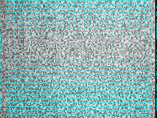
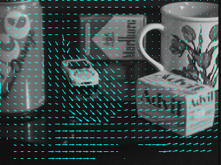
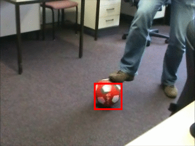
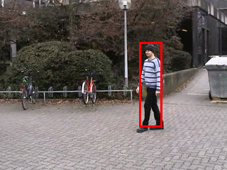

## CS766 Spring 2019: Homework 7

Author: YJC

Homework challenge: see 


To run the homework, type:
```
runHw7('all')
```
To run selected tests:
```
runHw7('challenge1a')
runHw7('challenge1b')
```


### debug1a 

I used a search window with half size of 20 and template window half size of 10, with 30 rows and 30 columns as grid in the input settings

Before computing the normalized cross-correlation, 
I padded the two inputs image with respective template and window's radius size here for cleaner output.




### Challenge 1a

I set a search window half size of 40, template window half size of 30, and set row and cols as the tenth of the input images' width and height. 




### Challenge 2

Using the first image and selected rectangular region as the base template, I calculated its color map and histogram to use it as template. 

For all subsequent images, all possible sliding frames within the set search windows are reshaped into columns per its RGB channel using im2col, and transformed into 2D matrices using ```rgb2ind```.

Histogram matrices are then calculated and compared with base template's histogram using pairwise linear correlation coefficient. 

The location of cell that contains maximum correlation values is recorded and the frame of the window is updated as the next frame. 


All template windows were set to be as small as possible to retain the unique color scheme of the subject. 

Half window size was set as 30 and 40 for **challenge2a** and **2b** as the movement changes between the subjects may be big.

## Challenge2a




## Challenge2b




## Challenge2c

I tried my best to use a much smaller half window size for challenge 2c as there are other similarly-colored subject. 


